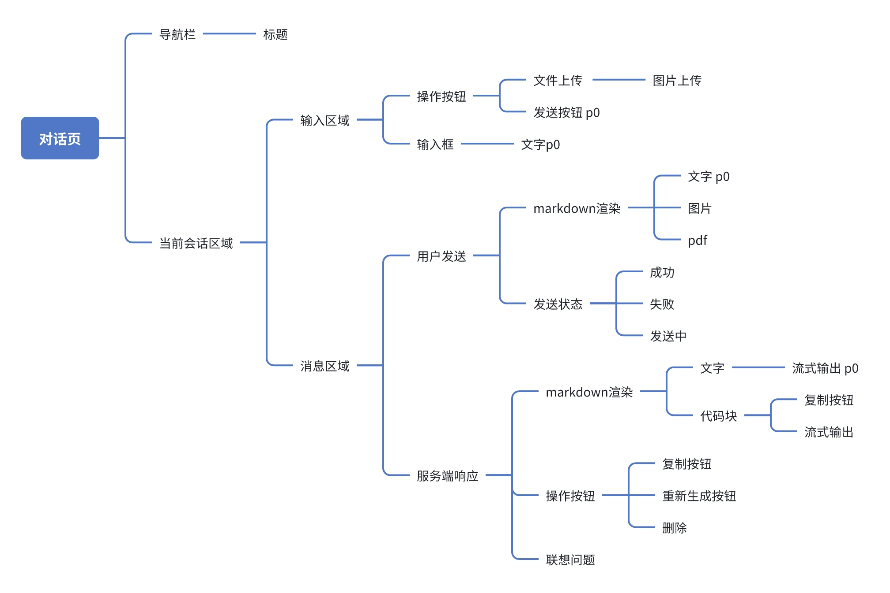

# chatBox

> 在线体验：[https://www.codeshi.site/](https://www.codeshi.site/)

chatBox 是一个用于接入 **Coze API** 的 AI 对话前端应用，基于 `React 18` + `TypeScript` + `Redux Toolkit` + `Ant Design 5` + `Webpack 5` 开发。旨在为应用或网站快速集成智能聊天功能。项目由字节跳动青训营期间开发，支持用户自定义配置、多轮对话、多模态内容输入、Markdown 渲染（含代码高亮）、会话管理等功能。

## 背景

在字节跳动青训营期间，为了提升项目开发能力，青训营安排了多个不同方向的项目。在前端方向的项目中，学生实现了 `LLM` 组件，其目标是开发一个实时聊天框组件，并接入大模型 API，例如 `Coze API`。在认真阅读项目需求后，学生基于该需求开发了 chatBox 组件，旨在为开发者提供一个简便易用的聊天框解决方案。

## 功能特性

| 类别 | 功能 | 说明 |
|------|------|------|
| 💬 智能对话 | 多轮对话 | 接入 Coze API，支持连续多轮对话交互 |
| | 流式响应 | 实时渲染 AI 流式输出，消息到达即时展示 |
| | 追问建议 | AI 自动生成 Follow-up 追问建议，一键发送 |
| | 重新生成 | 支持重新生成 AI 回复，流失败时旧消息不丢失 |
| 📝 内容渲染 | Markdown 渲染 | 基于 marked 库将 AI 回复解析为 HTML |
| | 代码高亮 | 10 种语言语法高亮 + 语言标签 + 一键复制 |
| | 图片渲染 | 支持 Markdown 内图片链接自动展示 |
| 📎 多模态输入 | 文本输入 | 支持 Enter 发送、Shift+Enter 换行 |
| | 文件/图片上传 | 上传文件到 Coze 并与消息一起发送 |
| | 文件预览 | 发送前缩略图预览，发送后历史展示 |
| 📂 会话管理 | 会话列表 | 侧边栏展示所有会话，支持快速切换 |
| | 自动标题 | 自动使用首条消息前 30 字作为会话标题 |
| | 会话搜索 | 按会话名称实时过滤搜索 |
| | 会话删除 | 可删除不需要的会话，自动切换至下一会话 |
| | 历史持久化 | 会话记录自动保存至 localStorage |
| 🔧 用户配置 | 自定义 API Key | 用户自行配置 Coze API Key，避免共享 Token 被滥用 |
| | 自定义 Bot ID | 用户自行指定 Bot ID |
| | 配置验证 | 格式校验 + Coze API 连接测试，确保配置有效 |
| | 交互式教程 | 内置 4 步图文教程，引导获取 API Key 和 Bot ID |
| | 配置状态指示 | 导航栏显示已配置/未配置状态图标 |
| 🎨 UI/UX | 深色主题 | 全局暗色主题设计 |
| | 响应式布局 | 基于 rem 自适应，支持桌面/平板/移动端 |
| | 空状态引导 | 空对话时显示欢迎提示语，输入框居中展示 |
| | 自动滚动 | 新消息到达时自动滚动至底部 |
| | 加载状态 | 历史加载 / 流式响应 / 请求等待均有状态指示 |
| | 错误兜底 | API 失败时显示友好错误提示 |
| | 自适应输入框 | textarea 高度随内容自动增长 |
| 🛡️ 安全保障 | 配置隔离 | 每位用户使用自有 API Key，互不干扰 |
| | 请求拦截 | 未配置时阻止消息发送并引导用户配置 |
| | 超时保护 | Coze API 客户端设置 60s 超时机制 |

## 功能演示

### 用户自定义配置


### 智能对话能力


### 多模态内容支持


### 响应内容支持


### 对话历史保存


### 会话历史列表操作


## 功能需求图



## 项目结构

```
chatBox/
├── build/                          # Webpack 构建配置
│   ├── webpack.base.js             # 公共构建配置
│   ├── webpack.dev.js              # 开发环境配置（热更新、source-map）
│   └── webpack.prod.js             # 生产环境配置（压缩、拷贝静态资源）
├── public/                         # 静态资源目录
│   └── index.html                  # HTML 模板
├── src/                            # 核心源码
│   ├── assets/                     # 静态资源（截图、图片等）
│   │   ├── imgs/                   # 图片资源
│   │   └── coze/                   # Coze 平台配置教程截图
│   ├── components/                 # UI 组件
│   │   ├── main.tsx                # 聊天消息展示区域
│   │   ├── bottom.tsx              # 输入区域（含文件上传）
│   │   ├── navbar.tsx              # 顶部导航栏
│   │   ├── userConfigModal.tsx     # 用户配置弹窗（API Key / Bot ID 设置）
│   │   └── marked.tsx              # Markdown 渲染（含代码高亮）
│   ├── pages/
│   │   └── home.tsx                # 主页面（布局 + 侧边栏）
│   ├── service/
│   │   └── index.tsx               # 服务层（Coze API 对话流式调用）
│   ├── store/
│   │   ├── index.tsx               # Redux Store 配置
│   │   └── modules/
│   │       ├── conversation.tsx    # 会话列表管理（localStorage 持久化）
│   │       ├── content.tsx         # 当前消息/响应/追问/消息 ID
│   │       ├── conversationInfo.tsx # 当前会话的历史消息
│   │       ├── loading.tsx         # 加载状态
│   │       ├── fileInfo.tsx        # 待上传文件信息
│   │       ├── sentFileInfo.tsx    # 已发送文件信息（localStorage 持久化）
│   │       └── userConfig.tsx      # 用户登录状态
│   ├── utils/
│   │   └── userConfig.ts           # 用户配置管理（API Key / Bot ID 校验与持久化）
│   ├── index.tsx                   # 应用入口
│   ├── App.tsx                     # 根组件
│   ├── app.less                    # 全局样式（深色主题）
│   └── highlight.tsx               # Highlight.js 代码高亮配置
├── .env                            # 环境变量（Coze Bot ID 和 API Token）
├── package.json
└── tsconfig.json
```

## 安装与使用

### 前置准备

项目现已支持自定义配置 API Key 与 Bot ID。在使用前，你需要准备：
1. 前往 [Coze 开放平台](https://www.coze.cn/open) 创建 Personal Access Token
2. 创建并发布你的 Bot，获取 Bot ID
3. 在应用启动后，点击导航栏右侧的配置图标填写以上信息

### 安装依赖

```sh
npm install
```

### 项目运行

```sh
npm run dev
```

### 项目打包

```sh
npm run build
```

## 数据流

### 用户配置流程

```
首次进入页面 → 检测未配置 → 弹出配置弹窗
  → 用户填写 API Key + Bot ID
  → 格式校验 + Coze API 连接测试
  → 保存到 localStorage → 状态图标更新
  → 可正常使用 AI 对话
```

### 消息发送流程

```
用户输入文本/选择文件 → 点击发送
  → 检测配置有效性（未配置则拦截并提示）
  → 调用 Coze API 流式对话
  → 实时更新 Redux 状态驱动 UI 渲染
  → 流完成后归档历史消息
  → 展示追问建议
```
