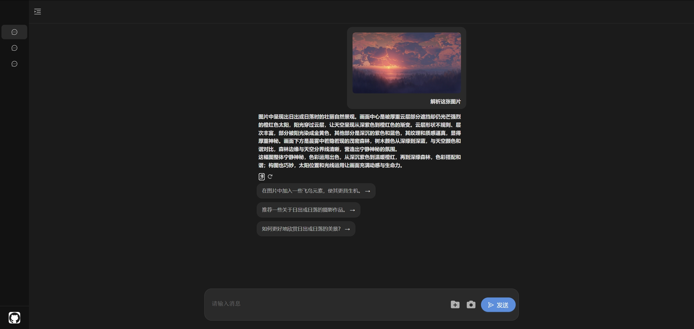

# chatBox

chatBox 是一个用于接入 `Coze API` 的聊天框组件，基于 `React` + `TS` + `Redux` 开发。旨在为应用或网站快速集成智能聊天功能。该组件由字节跳动青训营期间开发，提供简洁且可定制的聊天交互体验。

## 背景

在字节跳动青训营期间，为了提升项目开发能力，青训营安排了多个不同方向的项目。在前端方向的项目中，学生实现了 `LLM` 组件，其目标是开发一个实时聊天框组件，并接入大模型 API，例如 `Coze API`。在认真阅读项目需求后，学生基于该需求开发了 chatBox 组件，旨在为开发者提供一个简便易用的聊天框解决方案。

## 前言

在使用该项目之前，你需要配置个人的访问令牌，并将其保存在 `.env` 文件中。

## 功能演示

### 视频演示

https://github.com/user-attachments/assets/4a76c707-8855-42bc-84c2-138d38b43cc3

### 智能对话能力


### 多模态内容支持



### 响应内容支持


### 会话历史保存


## 功能需求图


## 安装依赖
```sh
npm install
```
## 项目运行

```sh
npm run dev
```
## 项目打包
```sh
npm run build
```


